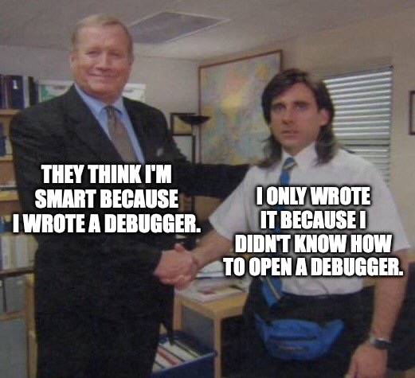

# Kharboosh

Kharboosh -pronounced /xarbu:ʃ/- is a robust debugging tool for Python that I believe will significantly enhance my coding experience.

## Core Features

* **Universal Debugging Solution** - It is designed to handle a wide range of tasks, from command-line applications to web tasks and asynchronous jobs.
* **Advanced Historical Tracing** - This feature allows you to trace back through the history of your objects, making it easier to identify and resolve issues.
* **Dynamic Object Visualization** - This provides a new way to view your objects, offering a deeper understanding of your code and data structures.
* **Live Debugging** - Enabling you to debug your code in real-time, eliminating the need for separate testing.

## Why Choose Kharboosh?

* **Superior Stability** - It is designed to avoid common issues that can occur during the debugging process.
* **Fast Performance** - Speed is a key focus, ensuring a smooth and efficient debugging experience.
* **Deep-Dive Inspection** - It offers a thorough inspection of your code, identifying issues that other debuggers might miss.

## Future Plans

I'm continuously working on adding features. Here's a glimpse into what's coming:

- [ ] **Expanded Functionality** - I'm working on providing a 'white-box' debugging experience, offering a clear view into the workings of your Python code.
- [ ] **Enhanced Real-Time Debugging** - I plan to improve the live debugging feature, allowing you to run and test functions in real-time.
- [ ] **Augmented Visualization** - I'm focused on enhancing the object visualizer to provide even more insightful views of your data structures.
- [ ] **Improved Feedback Mechanism** - I'm exploring the use of advanced machine-learning algorithms to provide predictive feedback during coding sessions.
- [ ] **Personalization** - I understand that every developer has unique needs, so I'm working on offering more customization options.
- [ ] **Extended Language Support** - I'm planning to add support for mixed-language debugging, making it easier to work with Python and other languages.
- [ ] **Collaborative Debugging** - I'm developing a feature that will allow real-time collaborative debugging.
- [ ] **Better Integrations** - I aim to integrate Kharboosh with popular CI/CD tools to streamline the testing experience during development.

## License

This software is for viewing purposes only. Unauthorized cloning, running, copying, distributing, or modifying the software is prohibited. For using this software, you must purchase a license from Muhamed Hassan at his [website](https://gaytomycode.com). For more details, please see the [LICENSE](./LICENSE.md) file in this repository.
